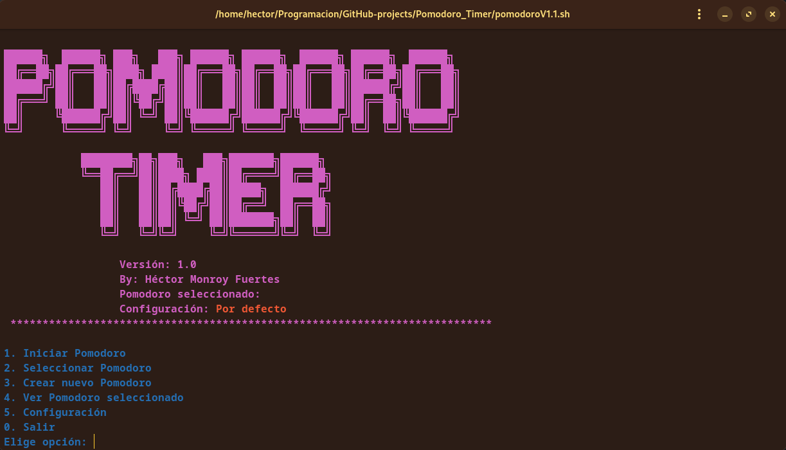
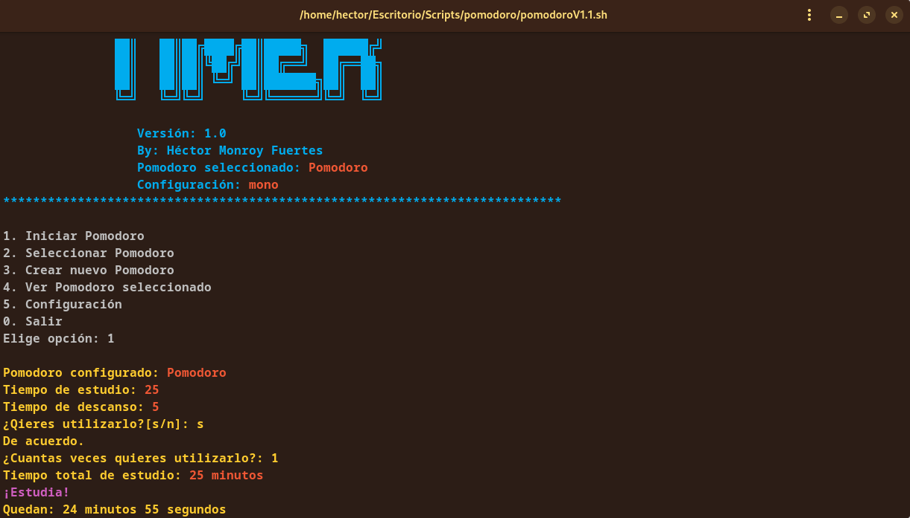

# Pomodoro Timer :tomato: :clock2:


  



## ¿Cual es la utilidad de este proyecto? ⁉️
Este pequeño proyecto desarrollado en Bash permite utilizar la técnica Pomodoro para estudiar, redactar tareas, programar... en intervalos de tiempo, aumentando el foco en la actividad en cuestón gracias a las pausas regulares. El script permite tanto la creación de Pomodoros personalizados como la modificación de la configuración de colores (cabecera/menús).  

## Uso  :gear:
Clona este repositorio:  
```
git clone https://github.com/HectorCRM/Pomodoro_Timer.git
```
Dale permiso de ejecución al archivo ***pomodoro-timer.sh***:  
```
chmod +x pomodoro-timer.sh
```
Ejecútalo:  
```
./pomodoro-timer.sh
```
Una vez ejecutado aparecerá el menú principal con las siguientes opciones:  
 - **1. Iniciar Pomodoro**(Previamente hay que selecionar el que queremos utilizar).  
 - **2. Seleccionar Pomodoro**: Esta opción permite elegir entre los pomodoros que hayamos creado. una vez elegido se mostrara en la cabecera del script el Pomodoro seleccionado.  
 - **3. Crear nuevo Pomodoro**: Mediante esta opción podemos crear nuevos Pomodoros personalizados.  
 - **4. Ver Pomodoro seleccionado**: Esta opción nos mostrará del Pomodoro seleccionado su nombre, la duración, la duración del descanso, la fecha de creación y el numero de veces que ha sido utilizado.  
 - **5. Configuracion**
  - **1. Crear configuración**: Permite crear combinaciones de color diferentes para el script, modificando el color de la cabecera y de los menus de forma independente. Muestra los colores disponibles.  
  - **2. Seleccionar configuración**: Permite seleccionar las diferentes configuraciones creadas. Una vez seleccionada, en la cabecera del script dejara de mostrar **configuracion por defecto** y mostrará el nombre de la que se ha seleccionado.  
  
  - **3. Eliminar configuración**: Permite eliminar configuraciones desde el propio script.  
  - **0. Salir**
 - **0. Salir**
  


## Requisitos :clipboard:
 - Git

## Mejoras futuras :rocket:
 - Implementar el uso de banderas.  

## Versiones :pushpin:
[Ver CHANGELOG](./CHANGELOG.md)
